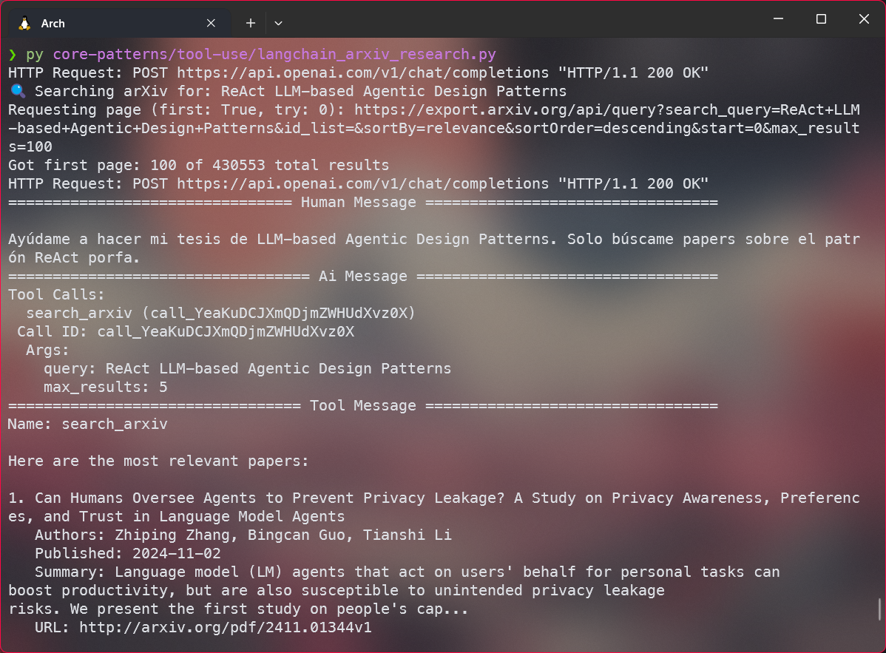

# Patrón de Uso de Herramientas (Tool Use Pattern)

Este directorio contiene ejemplos de implementación del patrón de uso de herramientas en agentes de LangChain. El patrón de uso de herramientas es fundamental para crear agentes que puedan interactuar con sistemas externos y realizar tareas específicas.

## Concepto

El patrón de uso de herramientas permite a un agente de LLM:
1. Entender qué herramienta usar basado en la entrada del usuario
2. Ejecutar la herramienta correctamente con los parámetros apropiados
3. Interpretar los resultados y comunicarlos al usuario
4. Mantener un contexto conversacional coherente

## Ejemplos Implementados

Se usó el siguiente esquema de grafo:


Esto es; el grafo empieza en el asistente, el asistente decide si usar una herramienta o no, si usa una herramienta, se ejecuta y se vuelve al asistente.

### 1. Consulta del Clima (`langchain_weather_demo.py`)

Los LLM no pueden hacer llamadas a APIs; pero podemos definir una herramienta que haga la llamada a la API y devuelva el resultado. En este caso, la herramienta es `get_weather`, que obtiene el clima actual de una ciudad.

**Herramientas implementadas:**
- `get_weather`: Obtiene el clima actual de una ciudad
- `convert_to_celsius`: Convierte temperaturas de Fahrenheit a Celsius

**Ejemplo de salida:**


En este caso el usuario pregunta si está soleado en Lima. El asistente usa la herramienta `get_weather` y devuelve la respuesta "Weather in Lima: 20.1°C (68.2°F), mainly clear, 83% humidity".


### 2. Investigación en ArXiv (`langchain_arxiv_research.py`)

Sabemos que los LLM tienden a alucinar. Sería imposible usar uno para una investigación académica. Pero gracias a las herramientas, podemos hacer que un agente de LLM haga búsquedas en ArXiv.

**Herramientas implementadas:**
- `search_arxiv`: Busca papers relacionados con una consulta
- `get_paper_details`: Obtiene información detallada de un paper específico

**Ejemplo de salida:**



En LangSmith:


### 3. Calculadora (`langchain_calculator.py`)

Los LLM, por su naturaleza autoregresiva probabilística, no son buenos para hacer cálculos matemáticos. Pero gracias a las herramientas, podemos hacer que un agente de LLM haga cálculos matemáticos.

**Herramientas implementadas:**
- `multiply`: Multiplica dos números
- `divide`: Divide dos números
- `add`: Suma dos números
- `subtract`: Resta dos números
- `exponent`: Eleva un número a una potencia. También puede calcular raíces si se le da el exponente fraccionario. Ejemplo: exponent(16, 0.5) = 4

**Ejemplo de salida:**


## Estructura del Patrón

Cada implementación sigue la siguiente estructura:

```python
# 1. Definición de Herramientas
@tool
def herramienta(parametros):
    """Documentación de la herramienta."""
    # Implementación

# 2. Configuración del LLM y Prompt
llm = ChatOpenAI(...)
system_message = SystemMessage(...)

# 3. Configuración del Grafo
builder = StateGraph(AgentState)

# Agregar nodos
builder.add_node("assistant", assistant)
builder.add_node("tools", ToolNode(tools))

# Conectar nodos
builder.add_edge(START, "assistant") # El grafo empieza en el asistente
builder.add_conditional_edges("assistant", tools_condition) # El asistente decide si usar una herramienta o no
builder.add_edge("tools", "assistant") # Si usa una herramienta, se ejecuta y se vuelve al asistente

# Crear el grafo
graph = builder.compile()

```

## Ventajas del Patrón

1. **Modularidad**: Las herramientas se pueden agregar o modificar fácilmente
2. **Reutilización**: Las herramientas se pueden compartir entre diferentes agentes
3. **Mantenibilidad**: Clara separación entre la lógica de las herramientas y el agente
4. **Extensibilidad**: Fácil de extender con nuevas funcionalidades

## Consideraciones de Implementación

- Las herramientas deben tener documentación clara para que el LLM entienda cuándo usarlas
- Los mensajes del sistema deben guiar al LLM en el uso apropiado de las herramientas
- Es importante manejar errores y casos edge en las implementaciones de las herramientas
- Las herramientas deben devolver resultados en un formato que el LLM pueda interpretar fácilmente

## Requisitos

```bash
pip install langchain langchain-openai python-dotenv arxiv-python
```

## Configuración

1. Crear un archivo `.env` con las claves necesarias:
```env
OPENAI_API_KEY=tu_clave_aquí
LANGCHAIN_API_KEY=tu_clave_aquí
```

2. Ejecutar cualquiera de los ejemplos:
```bash
python langchain_weather_demo.py
python langchain_arxiv_research.py
python langchain_calculator.py
``` 